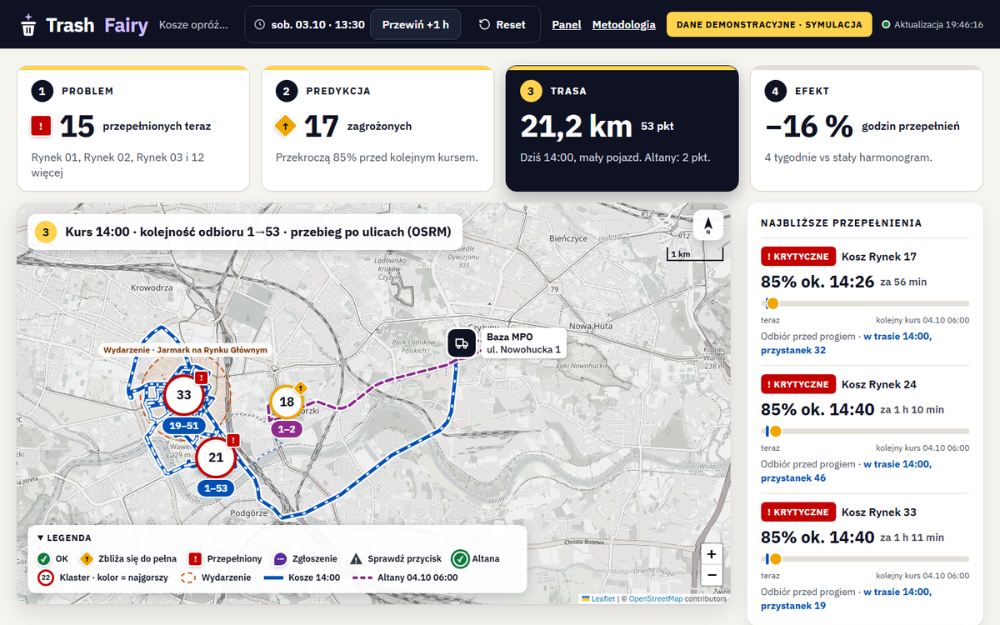
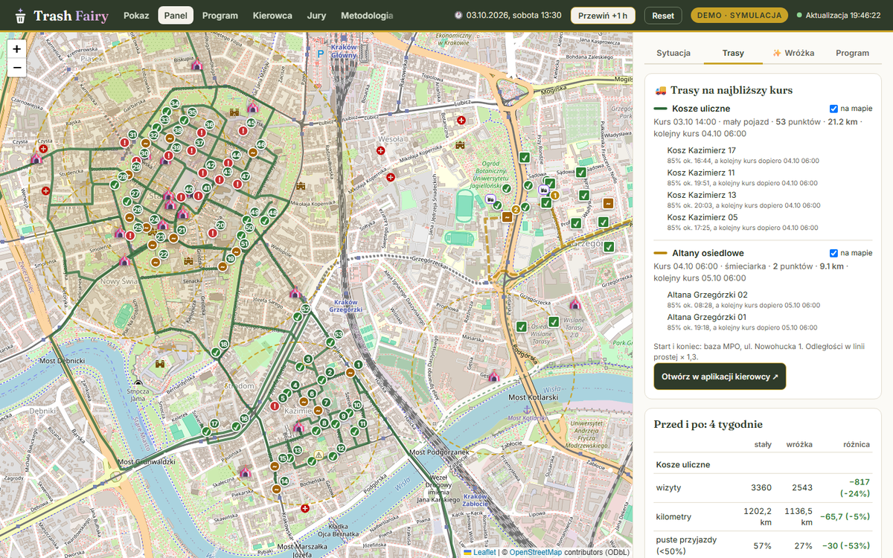
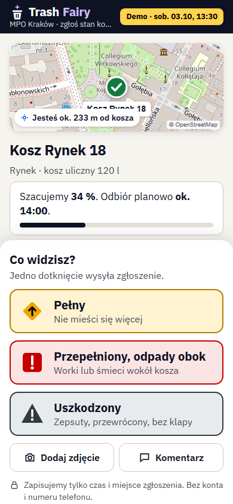
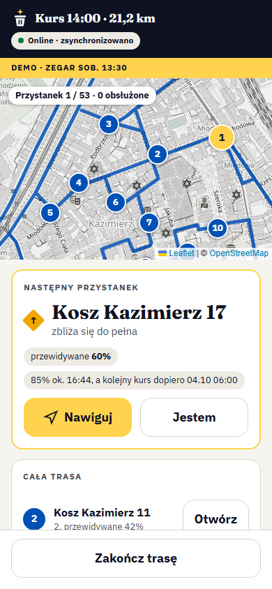
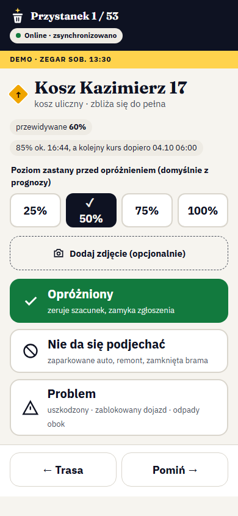

<p align="center"></p>

> **„Kraków nie potrzebuje więcej koszy, potrzebuje wróżki.”**
> HackYeah 2026 · Smart City (zadanie otwarte)

**Demo:** https://trashfairy.twapp.pl · **Kod:** https://github.com/TomaszWu14/trash-fairy · [English below](#english)



## Problem
Kosze uliczne w centrum Krakowa (Planty, Rynek, Kazimierz) przepełniają się, zwłaszcza w weekendy i podczas wydarzeń.
MPO opróżnia je według stałego harmonogramu, a nie według potrzeb: w Dzielnicy I 43% koszy jest opróżnianych 3× dziennie
(harmonogram MPO 08/2026). W naszej symulacji 71% opróżnień według stałego planu trafia na kosz zapełniony poniżej 75%. Część problemu bierze się z przepełnionych altan osiedlowych: mieszkańcy wynoszą domowe
worki do koszy ulicznych (KRKnews, 8.09.2026).

## Rozwiązanie
Trash Fairy to mózg dla MPO, który nie zależy od sprzętu. Zbiera tanie sygnały (przycisk „PEŁNY?” na koszu, zgłoszenia
z telefonu, dane od kierowców, zdjęcia), przewiduje zapełnienie, planuje trasy i podpowiada, gdzie opłaca się czujnik,
kompaktor albo większy kosz. **Decyzje podejmują jawne reguły w kodzie, a AI tylko opisuje i rozpoznaje.**

1. **Sygnał:** mieszkaniec naciska przycisk albo skanuje QR na koszu; zgłoszenia jednego kosza w ciągu 15 min łączą się w jedno, a waga zależy od wiarygodności przycisku.
2. **Prognoza:** profil 7 × 24 dla każdego kosza i mnożnik wydarzeń z Karnetu Kraków → godzina przekroczenia 85%.
3. **Trasa:** OR-Tools dla dwóch flot (kosze, altany) z bazy MPO przy ul. Nowohuckiej 1; przebieg po ulicach z OSRM.
4. **Efekt:** porównanie 4 tygodni ze stałym harmonogramem na tym samym przebiegu zapełniania.

## Wyniki (symulacja, 60 koszy i 12 altan, Stare Miasto, Kazimierz, Grzegórzki)

| Co | Stały harmonogram | Trash Fairy |
|---|---|---|
| Błąd prognozy (MAE, ostatni tydzień, bez przecieku) | 7,1 p.p. (stała średnia) | **2,4 p.p.** |
| Wizyty przy koszach (4 tygodnie) | 3 360 | **2 543 (−24%)** |
| Puste przyjazdy do koszy (< 50%) | 57% | **27%** |
| Godziny przepełnienia altan (4 tygodnie) | 338 h | **0 h** |
| Na miesiąc (5 zł/km, 4 zł za wizytę) | — | **−866 wizyt, ok. 2 976 zł mniej, +97 km** |

Kilometry altan rosną (+163 km w 4 tygodniach), bo śmieciarka jeździ wtedy, gdy trzeba, a nie co 3 dni. Pokazujemy to wprost;
założenia i wzory są na stronie `/metodologia`, wyliczone ze stałych w kodzie.

## Ekrany

| Adres | Dla kogo | Co robi |
|---|---|---|
| [`/`](https://trashfairy.twapp.pl/) | jury, dyspozytor | „Pokaz dla jury”: Problem → Predykcja → Trasa → Efekt na jednej mapie, QR do zgłoszenia na żywo |
| [`/dyspozytor`](https://trashfairy.twapp.pl/dyspozytor) | dyspozytor MPO | pełny panel: stan i prognoza punktu, trasy, raport „Wróżka podpowiada”, rekomendacje, program mieszkańców |
| [`/zglos`](https://trashfairy.twapp.pl/zglos) | mieszkaniec | PWA „Zgłoś kosz”: jedno dotknięcie, „Cofnij” 1,5 s, działa offline |
| [`/kierowca`](https://trashfairy.twapp.pl/kierowca) | kierowca MPO | PWA: start zmiany → następny przystanek → Opróżniony / Nie da się podjechać / Problem + zdjęcie → podsumowanie; działa bez zasięgu |
| [`/epapier/18`](https://trashfairy.twapp.pl/epapier/18) | urządzenie | symulator ekranu e-papierowego na koszu z fizycznym przyciskiem |
| [`/program`](https://trashfairy.twapp.pl/program) | mieszkaniec | „Przyjaciele Wróżki”: punkty tylko za trafne zgłoszenia, ranking dzielnic |
| [`/metodologia`](https://trashfairy.twapp.pl/metodologia) | wszyscy | założenia, wzory i liczby wprost z kodu |
| [`/jury`](https://trashfairy.twapp.pl/jury) | jury | losowy kosz przy Rynku do zgłoszenia z telefonu |

<p>

</p>
<p>



</p>

## Integracje i otwarte API
- **Pogoda (Open-Meteo, bez klucza):** mnożnik tempa zapełniania tylko na godziny przyszłe: deszcz ≥ 1 mm/h ×0,8, ciepły suchy weekend ×1,25.
- **Ruch (TomTom Traffic Flow, `TOMTOM_API_KEY`):** korek z 8 punktów na głównych drogach zmienia tylko czas przejazdu i ETA, nigdy wybór punktów ani km.
- **SMS (Twilio Verify):** kod przy rejestracji w programie mieszkańców; bez bramki kod demo na ekranie.
- **Otwarte API tylko do odczytu:** [`/api/v1/bins.geojson`](https://trashfairy.twapp.pl/api/v1/bins.geojson), `/api/v1/bins/<id>` (prognoza 24 h),
  `/api/v1/routes`, `/api/v1/conditions`; CORS *, `meta.synthetic`. Kontrakt OpenAPI 3.1 w `app/static/openapi.json`, opis na [`/api/docs`](https://trashfairy.twapp.pl/api/docs).

Każda integracja ma wyłącznik i bezpieczny stan bez sieci: brak danych oznacza mnożnik 1,0, a nie błąd.

## Uruchomienie
```bash
python -m venv .venv && .venv/Scripts/activate      # Linux/macOS: source .venv/bin/activate
pip install -r requirements.txt
flask --app app seed        # import punktów z data/*.geojson + 8 tygodni symulacji
flask --app app run         # http://localhost:5000 (albo -p 5050)
python -m pytest -q -n auto # 208 testów (pytest-xdist)
```
Docker: `docker build -t trash-fairy . && docker run -p 8080:8080 trash-fairy` (z `-e DATABASE_URL=...` dla PostgreSQL).
Zmienne środowiskowe: `ANTHROPIC_API_KEY`, `ANTHROPIC_MODEL`, `PUBLIC_URL` (adres w kodach QR), `SECRET_KEY`, `DATABASE_URL`, `DEMO_PASSWORD` (bez niego logowanie jest wyłączone),
`TOMTOM_API_KEY`, `TWILIO_ACCOUNT_SID`, `TWILIO_AUTH_TOKEN`, `TWILIO_VERIFY_SID`, `SMS_DEMO_FALLBACK=1`, `WEATHER_URL=""` (wyłącza pogodę).
Bez klucza API aplikacja działa w pełni; opisy AI pokazują komunikat i ostatni zapisany wynik.

## Dane i źródła
- **OpenStreetMap:** pozycje koszy, altan, lokali i przystanków; podkład mapy. © OpenStreetMap contributors, licencja ODbL 1.0.
  Cache w `data/*.geojson`, pobrany przez `scripts/fetch_osm.py` (Overpass API). Trasy po ulicach: OSRM, cache w `data/osrm_cache.json`.
- **Harmonogram oczyszczania MPO 08/2026** (9 383 kosze w Krakowie): częstotliwości opróżnień w Dzielnicy I, opis w `docs/kontekst-mpo.md`.
  Źródło: [mpo.krakow.pl/czystosc](https://mpo.krakow.pl/czystosc/), plik [harmonogram_oczyszczania_08_2026.xlsx](https://mpo.krakow.pl/wp/wp-content/uploads/2026/08/harmonogram_oczyszczania_08_2026.xlsx).
- **Karnet Kraków** (karnet.krakowculture.pl, Krakowskie Biuro Festiwalowe): nazwy, miejsca, daty i współrzędne wydarzeń, cache w `data/karnet.json`. Wydarzenia służą tylko jako sygnał tłumu w prognozie.
- **Wszystkie dane operacyjne** (poziomy zapełnienia, opróżnienia, zgłoszenia) są **syntetyczne**. Widok jury, panel i PWA kierowcy pokazują to na stałym pasku.
- Biblioteki: Flask, SQLAlchemy, OR-Tools (Apache 2.0), anthropic (MIT), Leaflet i Leaflet.markercluster (BSD-2), Chart.js (MIT), qrcode-generator (MIT), Pillow (HPND), IBM Plex i Fraunces (SIL OFL 1.1); wszystko lokalnie, bez CDN.

## Narzędzia AI
- **Claude Code** (Anthropic, Claude Opus 5.5): pisanie kodu, testów i dokumentacji oraz materiałów (slajdy, scenariusz wideo, napisy w `docs/video/`) podczas HackYeah; każdy etap zaczynał się od planu
  zaakceptowanego przez autora, a uzasadnienia decyzji są w `DECYZJE.md`.
- **Claude Design** (kanwa projektowa): trzy kierunki wizualne (A/B/C) dla widoku jury, PWA mieszkańca, PWA kierowcy i e-papieru;
  wybrany kierunek C „Marka Trash Fairy”. Paczki projektowe w `docs/widok-c/`, `docs/zgloszenie/`, `docs/epapier/`.
- **Claude API** (`anthropic`, model z `ANTHROPIC_MODEL`, domyślnie `claude-opus-5-5`) w działającej aplikacji, wyłącznie przez `app/llm.py`:
  analiza zdjęć koszy (Vision, structured outputs, zakaz opisywania osób), godziny i skala wydarzeń z Karnetu, raport „Wróżka podpowiada” dla dyspozytora.
- **Playwright i Lighthouse:** audyt UX (zrzuty 6 szerokości, poziomy scroll, wydajność i dostępność), wyniki w `docs/audit/RESULTS.md`.

## Bezpieczeństwo AI
- Każda treść z zewnątrz (opisy wydarzeń z Karnetu, zdjęcia, teksty od użytkowników) trafia do modelu wyłącznie jako dane
  w ograniczniku `<dane_zewnetrzne>…</dane_zewnetrzne>`, obcięte do 8 000 znaków; system prompt każe ignorować polecenia w danych,
  także w tekście widocznym na zdjęciu. Model nie ma narzędzi ani dostępu do bazy (`app/llm.py`).
- Każda odpowiedź przechodzi walidację schematu (`llm.validate`): tylko dozwolone pola, wartości z białej listy
  (np. poziom ∈ {0, 25, 50, 75, 100}, skala tłumu ∈ {small, medium, large}), zakresy liczb i długości tekstów.
  Odrzucona odpowiedź = komunikat w UI i ostatni dobry wynik z bazy, nigdy błąd 500.
- Decyzje (stan, priorytet, trasa, rekomendacja) liczą reguły w kodzie ze zwalidowanych pól; wolny tekst AI jest tylko wyświetlany,
  zawsze przez escapowanie (Jinja autoescape, `esc()` w JS), bez `|safe` i bez klikalnych linków. Testy: `tests/test_ai_safety.py`.

## Dostępność
UI po polsku, WCAG 2.1 AA: stan kosza to zawsze kolor + kształt + znak (✓, ↑, !), nigdy sam kolor; cele dotykowe w PWA kierowcy od 56 px;
tryb ciemny w PWA; Lighthouse Accessibility 97–100 na wszystkich ekranach (`docs/audit/RESULTS.md`).

## Licencja
[GNU AGPL-3.0](LICENSE): kod można używać i zmieniać, także w sektorze publicznym, ale kto uruchomi zmienioną wersję
jako usługę, musi udostępnić jej kod. Atrybucje danych i bibliotek: [NOTICE](NOTICE).

## Przejrzystość
Koncepcja została przemyślana przed wydarzeniem i jest w `docs/KONCEPCJA.md` (bez kodu).
**Cały kod powstał podczas HackYeah, 3–4.10.2026.** Historię zmian pokazują commity od tagu `start-hackyeah`,
a uzasadnienia decyzji (co, dlaczego, jaką alternatywę odrzuciliśmy) są w `DECYZJE.md`.

---

## English

**Trash Fairy** is a hardware-agnostic brain for Kraków's waste collection company (MPO). Street bins in the city centre
overflow because they are emptied on a fixed schedule, not on demand (in District I, 43% of bins are emptied 3× a day;
in our simulation 71% of scheduled emptyings find the bin below 75% full), and partly because residents dump household bags from overflowing housing-estate shelters.
Trash Fairy collects cheap signals (a "FULL?" button and QR code on the bin, driver reports, photos), forecasts fill levels,
plans routes and recommends where a sensor, a compactor or a bigger bin pays off.
**All decisions are made by explicit rules in code. AI only describes and recognises.**

**Results (simulation, 60 bins and 12 shelters, 4 weeks vs the fixed schedule):** forecast MAE 2.4 p.p. vs 7.1 for a naive mean;
bins −24% visits and empty trips down from 57% to 27%; shelter overflow hours 338 → 0; per month −866 visits, ≈ PLN 2,976 saved, +97 km.

**Screens:** `/` jury walkthrough (Problem → Prediction → Route → Effect), `/dyspozytor` dispatcher panel,
`/zglos` resident PWA (one tap, works offline), `/kierowca` driver PWA (next stop, Emptied / Can't reach / Problem + photo, works offline),
`/epapier/18` e-paper display simulator, `/metodologia` assumptions straight from code. **Demo:** https://trashfairy.twapp.pl

**Data:** © OpenStreetMap contributors (ODbL 1.0), Karnet Kraków events, MPO cleaning schedule 08/2026 ([mpo.krakow.pl/czystosc](https://mpo.krakow.pl/czystosc/)). All operational data is synthetic.
**AI tools:** Claude Code (Claude Opus 5.5) for development and pitch materials (slides, video script, subtitles), Claude Design canvas for visual directions, Claude API in the app
(photo analysis, event parsing, dispatcher report) behind input fencing and schema validation; Playwright and Lighthouse for the UX audit.

**Transparency:** the concept was prepared before the event (`docs/KONCEPCJA.md`, no code).
**All code was written during HackYeah, 3–4 Oct 2026**, starting at the `start-hackyeah` tag.
