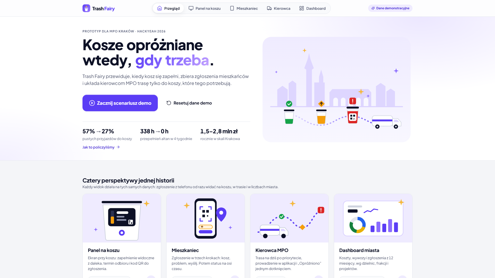
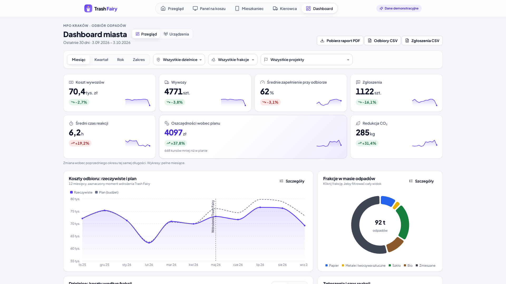
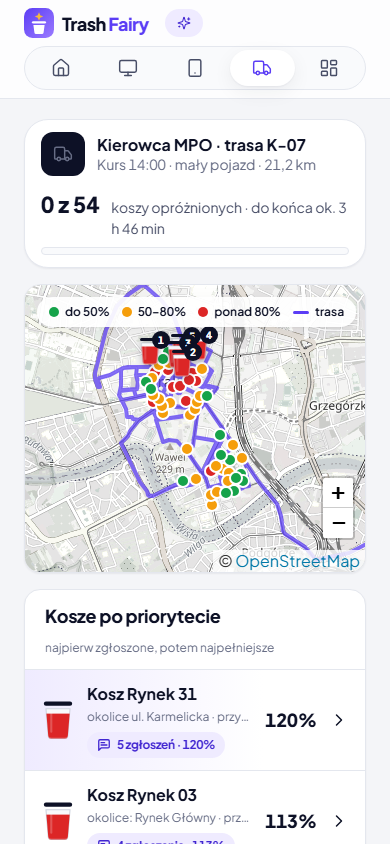
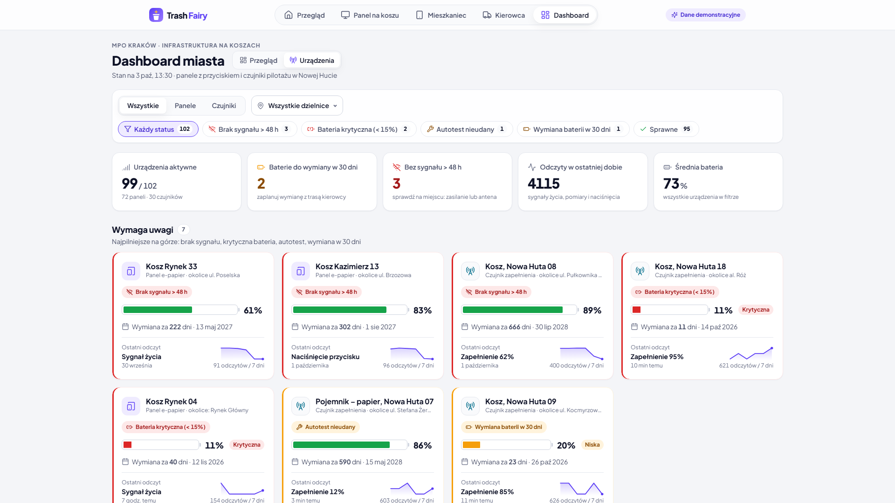
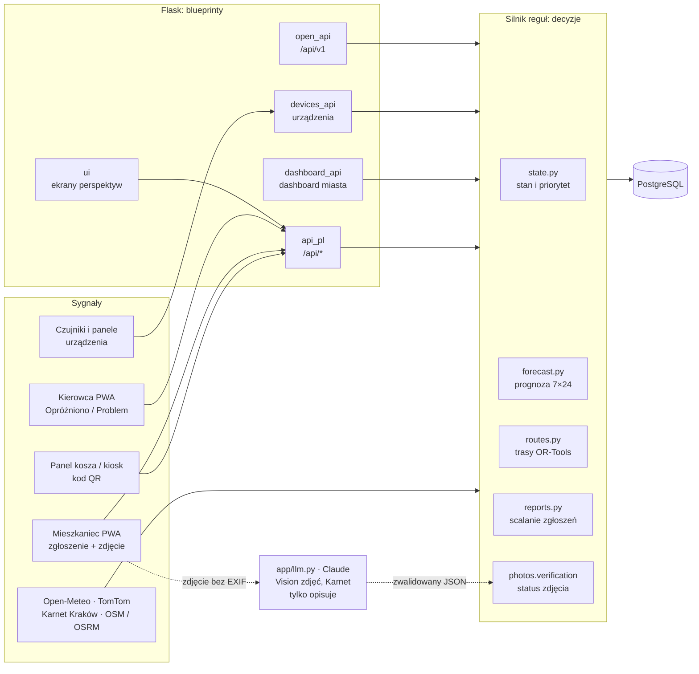

<p align="center"></p>

> **„Kraków nie potrzebuje więcej koszy, potrzebuje wróżki.”**
> HackYeah 2026 · Smart City (zadanie otwarte)

**Demo:** https://trashfairy.twapp.pl · **Kod:** https://github.com/TomaszWu14/trash-fairy · [English below](#english)

| | |
|---|---|
|  |  |
|  |  |
|  |  |

Przed i po przebudowie każdej perspektywy: [`audit/PRZED-PO.html`](audit/PRZED-PO.html). Jak poprowadzić pokaz w 3 minuty: [`DEMO.md`](DEMO.md).

## Problem
Kosze uliczne w centrum Krakowa (Planty, Rynek, Kazimierz) przepełniają się, zwłaszcza w weekendy i podczas wydarzeń.
MPO opróżnia je według stałego harmonogramu, a nie według potrzeb: w Dzielnicy I 43% koszy jest opróżnianych 3× dziennie
(harmonogram MPO 08/2026). W naszej symulacji 71% opróżnień według stałego planu trafia na kosz zapełniony poniżej 75%. Część problemu bierze się z przepełnionych altan osiedlowych: mieszkańcy wynoszą domowe
worki do koszy ulicznych (KRKnews, 8.09.2026).

## Rozwiązanie
Trash Fairy to mózg dla MPO, który nie zależy od sprzętu. Zbiera tanie sygnały (przycisk „PEŁNY?” na koszu, zgłoszenia
z telefonu, dane od kierowców, zdjęcia), przewiduje zapełnienie, planuje trasy i podpowiada, gdzie opłaca się czujnik,
kompaktor albo większy kosz. **Decyzje podejmują jawne reguły w kodzie, a AI tylko opisuje i rozpoznaje.**

1. **Sygnał:** mieszkaniec naciska przycisk albo skanuje QR na koszu; zgłoszenia jednego kosza w ciągu 15 min łączą się w jedno, a waga zależy od wiarygodności przycisku.
2. **Prognoza:** profil 7 × 24 dla każdego kosza i mnożnik wydarzeń z Karnetu Kraków → godzina przekroczenia 85%.
3. **Trasa:** OR-Tools dla dwóch flot (kosze, altany) z bazy MPO przy ul. Nowohuckiej 1; przebieg po ulicach z OSRM.
4. **Efekt:** porównanie 4 tygodni ze stałym harmonogramem na tym samym przebiegu zapełniania.

## Architektura



Sygnały wchodzą przez blueprinty, ale każdą decyzję (stan, priorytet, prognoza, trasa, status zdjęcia) liczą reguły w kodzie.
`app/llm.py` to jedyne miejsce z modelem: opisuje zdjęcia i wydarzenia, a jego odpowiedź po walidacji schematu jest tylko wejściem dla reguły.

## Wyniki (symulacja, 60 koszy i 12 altan, Stare Miasto, Kazimierz, Grzegórzki)

| Co | Stały harmonogram | Trash Fairy |
|---|---|---|
| Błąd prognozy (MAE, ostatni tydzień, bez przecieku) | 7,1 p.p. (stała średnia) | **2,4 p.p.** |
| Odbiory koszy (4 tygodnie) | 3 360 | **2 543 (−24%)** |
| Puste przyjazdy do koszy (< 50%) | 57% | **27%** |
| Godziny przepełnienia altan (4 tygodnie) | 338 h | **0 h** |
| Na miesiąc (12 zł za odbiór, 5 zł/km) | — | **−866 odbiorów, ok. 9 902 zł mniej [z produkcji], +97 km** |

Kilometry altan rosną (+163 km w 4 tygodniach), bo śmieciarka jeździ wtedy, gdy trzeba, a nie co 3 dni. Pokazujemy to wprost;
założenia i wzory są na stronie `/metodologia`, wyliczone ze stałych w kodzie.

## Co prawdziwe, co symulowane

| Prawdziwe | Symulowane |
|---|---|
| Położenia koszy i altan oraz frakcje z OpenStreetMap | Poziomy zapełnienia koszy |
| Przebiegi po ulicach z OSRM | Historia 12 miesięcy na dashboardzie (deterministyczny generator `app/history.py`) |
| Harmonogram oczyszczania MPO 08/2026 | Koszty, masy i projekty w dzielnicach |
| Wydarzenia z Karnetu Kraków, pogoda z Open-Meteo | Urządzenia i ich telemetria (bateria, sygnał życia, autotest) |
| Reguły, silnik prognozy i trasy OR-Tools | Położenie mieszkańca w demo (jury nie stoi przy koszu) |
| Analiza zdjęć przez Claude Vision (gdy jest klucz API) | |
| Zgłoszenia i odbiory wykonane w pokazie: zapisywane w bazie i od razu liczone na dashboardzie | |

Każdy ekran z danymi syntetycznymi ma plakietkę **„Dane demonstracyjne”** z linkiem do `/metodologia`.

## AI w przepływie

1. Mieszkaniec dołącza zdjęcie do zgłoszenia.
2. Serwer koduje obraz od nowa bez EXIF (GPS, model aparatu, czas), zanim go zapisze lub wyśle (`photos.strip_metadata`).
3. Claude Vision przez `app/llm.py` ocenia wyłącznie kosz: czy jest widoczny, stan, zapełnienie 0/25/50/75/100% i pewność. Odpowiedź musi pasować do schematu JSON i przejść walidację.
4. Reguła `photos.verification` (nie AI) nadaje status: **„Zweryfikowane AI”**, gdy kosz jest widoczny, stan zgadza się z typem zgłoszenia, a pewność ≥ 0,7; w każdym innym przypadku **„Do weryfikacji”** przez dyspozytora.
5. AI nigdy nie odrzuca zgłoszenia. Bez klucza API albo przy błędzie zgłoszenie trafia „Do weryfikacji”, a aplikacja działa w pełni.

## Ekrany (jedna rola „Przegląd jury”, bez logowania)

| Adres | Perspektywa | Co robi |
|---|---|---|
| [`/`](https://trashfairy.twapp.pl/) | Przegląd | pięć perspektyw, liczby z kodu, **losowany scenariusz demo** (A: kod QR z panelu kosza, B: przycisk „Przepełniony” na panelu, C: dzikie wysypisko; stały przebieg: `/?scenariusz=A&kosz=18`) i reset danych demo |
| [`/panel/18`](https://trashfairy.twapp.pl/panel/18) | Panel kosza | kiosk 1280×800: zapełnienie z daleka, termin odbioru, status zgłoszeń, kod QR do zgłoszenia |
| [`/zglos`](https://trashfairy.twapp.pl/zglos) → `/zglos/<id>` → `/zgloszenie/<nr>` | Mieszkaniec | skan kodu QR z Panelu kosza (bez mapy i listy koszy; kod zmienia się codziennie), zgłoszenie na jednym ekranie, oś czasu statusu, punkty; dzikie wysypisko poza koszem: [`/wysypisko`](https://trashfairy.twapp.pl/wysypisko) |
| [`/kierowca`](https://trashfairy.twapp.pl/kierowca) → `/kierowca/kosz/<id>` | Kierowca | trasa po priorytecie z postępem, „Jadę” z nawigacją w aplikacji, „Opróżniono” z opcjonalnym zdjęciem kosza (dowód odbioru: położenie śmieciarki i zdjęcie), „Problem” |
| [`/dyspozytor`](https://trashfairy.twapp.pl/dyspozytor) | Dyspozytor | mapa koszy na żywo z ikonami stanów, gorące obszary zgłoszeń, dzikie wysypiska; Pilne („Dodaj do kursu” to decyzja człowieka), Ekipy i trasy, Zgłoszenia na żywo |
| [`/dashboard`](https://trashfairy.twapp.pl/dashboard) → `/dashboard/projekty/<slug>` | Dashboard miasta | KPI ze zmianą i trendem, koszty vs plan, frakcje, dzielnice, zgłoszenia, heatmapa, mapa, projekty; filtry i drill-down |
| [`/metodologia`](https://trashfairy.twapp.pl/metodologia) | wszyscy | założenia, wzory i liczby wprost z kodu |

Stare adresy (`/telefony`, `/epapier/<id>`, kody QR z naklejek) przekierowują do nowych ekranów.
Pomocniczo: [`/dashboard/urzadzenia`](https://trashfairy.twapp.pl/dashboard/urzadzenia) (bateria, odczyty i status paneli oraz czujników).
Audyt i przebudowa: `audit/AUDYT-UX.md`, zrzuty rund w `audit/iteracje/`, przed i po: [`audit/PRZED-PO.html`](audit/PRZED-PO.html), jak poprowadzić pokaz: [`DEMO.md`](DEMO.md).

## Dla miasta i dyspozytora (reguły w kodzie)
- **Terminowość:** KPI „Obsłużone w ≤ 2 h” (norma MPO dla interwencji) w mieście i wg dzielnic, ze zmianą wobec poprzedniego okresu.
- **Anomalie ekipy:** odbiór potwierdzony dalej niż 150 m od kosza (położenie telefonu kierowcy), liczba, udział i lista.
- **Trafność zgłoszeń:** udział zgłoszeń potwierdzonych przy odbiorze (kosz zapełniony co najmniej w 75%) wg dzielnic.
- **Kolejka napraw:** zgłoszenia „Uszkodzony” nie czekają na trasę śmieciarki: osobna lista z terminem 24 h i statusem „w terminie” / „po terminie”.
- **Dlaczego nie na trasie:** kierowca i dyspozytor widzą powód pominięcia kosza w kursie (np. „poziom 42%, 85% dopiero po kolejnym kursie”).
- **AI obniża priorytet, nigdy nie odrzuca:** gdy zdjęcie od mieszkańca pokazuje kosz w porządku (pewność AI ≥ 0,8), kosz idzie za innymi zgłoszonymi.
- **Pojemność pojazdów:** OR-Tools z wymiarem pojemności i do 3 pojazdów na flotę; w obszarze demo wystarcza jeden pojazd na flotę.

## Integracje i otwarte API
- **Pogoda (Open-Meteo, bez klucza):** mnożnik tempa zapełniania tylko na godziny przyszłe: deszcz ≥ 1 mm/h ×0,8, ciepły suchy weekend ×1,25.
- **Ruch (TomTom Traffic Flow, `TOMTOM_API_KEY`):** korek z 8 punktów na głównych drogach zmienia tylko czas przejazdu i ETA, nigdy wybór punktów ani km.
- **SMS (Twilio Verify):** kod przy rejestracji w programie mieszkańców; bez bramki kod demo na ekranie.
- **Otwarte API tylko do odczytu:** [`/api/v1/bins.geojson`](https://trashfairy.twapp.pl/api/v1/bins.geojson), `/api/v1/bins/<id>` (prognoza 24 h),
  `/api/v1/routes`, `/api/v1/conditions`, open data [`/api/v1/open-data/miesieczne.csv`](https://trashfairy.twapp.pl/api/v1/open-data/miesieczne.csv)
  (miesięcznie wg dzielnicy i frakcji) i zgłoszenia w formacie **Open311 GeoReport v2** (`/api/v1/open311/requests.json`, `services.json`)
  do miejskiego systemu zgłoszeń, bez danych osobowych; CORS *, `meta.synthetic`. Kontrakt OpenAPI 3.1 w `app/static/openapi.json`, opis na [`/api/docs`](https://trashfairy.twapp.pl/api/docs).

Każda integracja ma wyłącznik i bezpieczny stan bez sieci: brak danych oznacza mnożnik 1,0, a nie błąd.

## Uruchomienie
Najprościej, jednym poleceniem (aplikacja + PostgreSQL 16, seed punktów i symulacji startuje sam):
```bash
docker compose up --build   # http://localhost:8080
```
Lokalnie bez Dockera (SQLite):
```bash
python -m venv .venv && .venv/Scripts/activate      # Linux/macOS: source .venv/bin/activate
pip install -r requirements.txt
flask --app app seed        # import punktów z data/*.geojson + 8 tygodni symulacji
flask --app app run         # http://localhost:5000 (albo -p 5050)
python -m pytest -q -n auto # ponad 270 testów (pytest-xdist)
```
Sam obraz: `docker build -t trash-fairy . && docker run -p 8080:8080 trash-fairy` (z `-e DATABASE_URL=...` dla PostgreSQL).
Zmienne środowiskowe: `ANTHROPIC_API_KEY`, `ANTHROPIC_MODEL`, `PUBLIC_URL` (adres w kodach QR), `SECRET_KEY`, `DATABASE_URL`,
`TOMTOM_API_KEY`, `TWILIO_ACCOUNT_SID`, `TWILIO_AUTH_TOKEN`, `TWILIO_VERIFY_SID`, `SMS_DEMO_FALLBACK=1`, `WEATHER_URL=""` (wyłącza pogodę).
Bez klucza API aplikacja działa w pełni; zdjęcia trafiają „Do weryfikacji”, a opisy AI pokazują komunikat i ostatni zapisany wynik.

## Dane i źródła
- **OpenStreetMap:** pozycje koszy, altan, lokali i przystanków; podkład mapy. © OpenStreetMap contributors, licencja ODbL 1.0.
  Cache w `data/*.geojson`, pobrany przez `scripts/fetch_osm.py` (Overpass API). Trasy po ulicach: OSRM, cache w `data/osrm_cache.json`.
- **Harmonogram oczyszczania MPO 08/2026** (9 383 kosze w Krakowie): częstotliwości opróżnień w Dzielnicy I, opis w `docs/kontekst-mpo.md`.
  Źródło: [mpo.krakow.pl/czystosc](https://mpo.krakow.pl/czystosc/), plik [harmonogram_oczyszczania_08_2026.xlsx](https://mpo.krakow.pl/wp/wp-content/uploads/2026/08/harmonogram_oczyszczania_08_2026.xlsx).
- **Karnet Kraków** (karnet.krakowculture.pl, Krakowskie Biuro Festiwalowe): nazwy, miejsca, daty i współrzędne wydarzeń, cache w `data/karnet.json`. Wydarzenia służą tylko jako sygnał tłumu w prognozie.
- **Dane operacyjne** (poziomy zapełnienia, historia odbiorów, koszty, urządzenia) są **syntetyczne**, patrz [Co prawdziwe, co symulowane](#co-prawdziwe-co-symulowane). Ekrany pokazują to plakietką „Dane demonstracyjne”.
- Biblioteki: Flask, SQLAlchemy, OR-Tools (Apache 2.0), anthropic (MIT), Leaflet (BSD-2) i Leaflet.markercluster (MIT), Apache ECharts (Apache 2.0), qrcode-generator (MIT), Pillow (HPND), ikony Lucide (ISC), Plus Jakarta Sans (SIL OFL 1.1); wszystko lokalnie, bez CDN.

## Narzędzia AI
- **Claude Code** (Anthropic, Claude Opus 5.5): pisanie kodu, testów i dokumentacji oraz materiałów (slajdy, scenariusz wideo, napisy w `docs/video/`) podczas HackYeah; każdy etap zaczynał się od planu
  zaakceptowanego przez autora, a uzasadnienia decyzji są w `DECYZJE.md`.
- **Claude Design** (kanwa projektowa): trzy kierunki wizualne (A/B/C) dla widoku jury, PWA mieszkańca, PWA kierowcy i e-papieru;
  wybrany kierunek C „Marka Trash Fairy”. Paczki projektowe w `docs/widok-c/`, `docs/zgloszenie/`, `docs/epapier/`.
- **Claude API** (`anthropic`, model z `ANTHROPIC_MODEL`, domyślnie `claude-opus-5-5`) w działającej aplikacji, wyłącznie przez `app/llm.py`:
  analiza zdjęć ze zgłoszeń mieszkańców (Vision, schemat JSON, zakaz opisywania osób; status nadaje reguła, patrz [AI w przepływie](#ai-w-przepływie)), godziny i skala wydarzeń z Karnetu.
- **Playwright i Lighthouse:** audyt UX (zrzuty 6 szerokości, poziomy scroll, wydajność i dostępność), wyniki w `audit/lighthouse/` (wcześniejsze rundy: `docs/audit/RESULTS.md`).

## Bezpieczeństwo AI
- Każda treść z zewnątrz (opisy wydarzeń z Karnetu, zdjęcia, teksty od użytkowników) trafia do modelu wyłącznie jako dane
  w ograniczniku `<dane_zewnetrzne>…</dane_zewnetrzne>`, obcięte do 8 000 znaków; system prompt każe ignorować polecenia w danych,
  także w tekście widocznym na zdjęciu. Model nie ma narzędzi ani dostępu do bazy (`app/llm.py`).
- Każda odpowiedź przechodzi walidację schematu (`llm.validate`): tylko dozwolone pola, wartości z białej listy
  (np. poziom ∈ {0, 25, 50, 75, 100}, skala tłumu ∈ {small, medium, large}), zakresy liczb i długości tekstów.
  Odrzucona odpowiedź = komunikat w UI i ostatni dobry wynik z bazy, nigdy błąd 500.
- Decyzje (stan, priorytet, trasa, rekomendacja) liczą reguły w kodzie ze zwalidowanych pól; wolny tekst AI jest tylko wyświetlany,
  zawsze przez escapowanie (Jinja autoescape, `esc()` w JS), bez `|safe` i bez klikalnych linków. Testy: `tests/test_ai_safety.py`.

## Dostępność
UI po polsku, WCAG 2.1 AA: stan kosza to zawsze kolor + ikona + tekst, nigdy sam kolor; cele dotykowe w PWA kierowcy od 56 px;
strony `/dostepnosc` i `/prywatnosc`. Raporty Lighthouse (desktop i telefon) dla `/` i `/dashboard` są w `audit/lighthouse/`.

Lighthouse 12 (lokalnie, `audit/lighthouse/`): `/` wydajność 93 telefon / 100 desktop, `/dashboard` 99 desktop (na telefonie 77: wykresy ECharts przy symulowanym słabym CPU, własna paczka 645 kB; dashboard to narzędzie biurowe), dostępność, dobre praktyki i SEO 100 na obu. axe-core (WCAG 2.1 A/AA, `scripts/axe_check.py`): 0 naruszeń na 8 ekranach w 1366 px i 390 px.

## Licencja
[GNU AGPL-3.0](LICENSE): kod można używać i zmieniać, także w sektorze publicznym, ale kto uruchomi zmienioną wersję
jako usługę, musi udostępnić jej kod. Atrybucje danych i bibliotek: [NOTICE](NOTICE).

## Przejrzystość
Koncepcja została przemyślana przed wydarzeniem i jest w `docs/KONCEPCJA.md` (bez kodu).
**Cały kod powstał podczas HackYeah, 3–4.10.2026.** Historię zmian pokazują commity od tagu `start-hackyeah`,
a uzasadnienia decyzji (co, dlaczego, jaką alternatywę odrzuciliśmy) są w `DECYZJE.md`.

---

## English

**Trash Fairy** is a hardware-agnostic brain for Kraków's waste collection company (MPO). Street bins in the city centre
overflow because they are emptied on a fixed schedule, not on demand (in District I, 43% of bins are emptied 3× a day;
in our simulation 71% of scheduled emptyings find the bin below 75% full), and partly because residents dump household bags from overflowing housing-estate shelters.
Trash Fairy collects cheap signals (a "FULL?" button and QR code on the bin, driver reports, photos), forecasts fill levels,
plans routes and recommends where a sensor, a compactor or a bigger bin pays off.
**All decisions are made by explicit rules in code. AI only describes and recognises.**

**Results (simulation, 60 bins and 12 shelters, 4 weeks vs the fixed schedule):** forecast MAE 2.4 p.p. vs 7.1 for a naive mean;
bins −24% pickups and empty trips down from 57% to 27%; shelter overflow hours 338 → 0; per month −866 pickups, ≈ PLN 9,902 saved [from production] at PLN 12 per pickup, +97 km.

**Screens (no login):** `/` overview with a randomly drawn demo scenario (QR on the bin panel, panel button, illegal dumping), `/panel/18` bin kiosk (fill level visible from afar, pickup time, QR code),
`/zglos` resident PWA (scan the bin panel's daily QR code, one-screen report; `/wysypisko` for illegal dumping), `/kierowca` driver PWA (route by priority, in-app navigation, Emptied with an optional bin photo / Problem), `/dyspozytor` dispatcher (live map, urgent bins, crews and routes),
`/dashboard` city dashboard (costs vs plan, fractions, districts, projects), `/dashboard/urzadzenia` devices (battery, heartbeat, status),
`/metodologia` assumptions straight from code. **Demo:** https://trashfairy.twapp.pl · **Run locally:** `docker compose up --build` → http://localhost:8080 (app + PostgreSQL 16).

**AI photo verification:** a resident's photo is stripped of EXIF, assessed by Claude Vision against a JSON schema, and a rule in code
(`photos.verification`) marks the report "AI-verified" or "To be checked". AI never rejects a report; without an API key everything still works.

**Data:** © OpenStreetMap contributors (ODbL 1.0), Karnet Kraków events, MPO cleaning schedule 08/2026 ([mpo.krakow.pl/czystosc](https://mpo.krakow.pl/czystosc/)). Operational data (fill levels, 12-month dashboard history, costs, devices) is synthetic and labelled "Dane demonstracyjne".
**AI tools:** Claude Code (Claude Opus 5.5) for development and pitch materials (slides, video script, subtitles), Claude Design canvas for visual directions, Claude API in the app
(resident photo analysis, event parsing) behind input fencing and schema validation; Playwright and Lighthouse for the UX audit.

**Transparency:** the concept was prepared before the event (`docs/KONCEPCJA.md`, no code).
**All code was written during HackYeah, 3–4 Oct 2026**, starting at the `start-hackyeah` tag.
