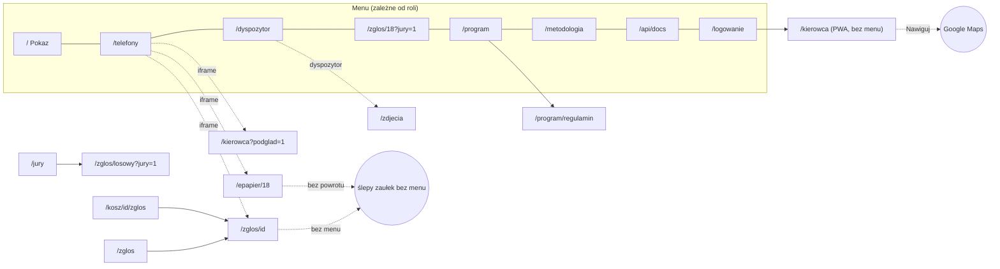
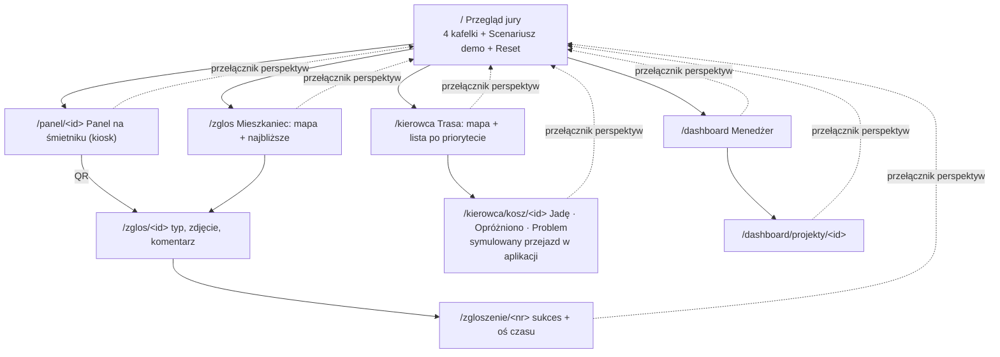

# Audyt UX, ekranów i API: Trash Fairy (Etap 1)

Stan na niedz. 4.10.2026, ok. 00:20, `main` = PR #10. Zrzuty: `audit/zrzuty/przed/{desktop,telefon,kiosk}/*.png`
(63 zrzuty: 21 ekranów × 1920×1080, 390×844, 1280×800), surowe wyniki: `audit/zrzuty/przed/raport.json`.
Bez zmian w kodzie.

**Wniosek w jednym zdaniu:** technicznie aplikacja jest zdrowa (0 błędów 500, 0 błędów JS, 0 martwych linków na 101 sprawdzonych),
ale wizualnie i nawigacyjnie to sześć aplikacji pod jednym logo: 4 arkusze CSS + 5 bloków `<style>` w szablonach, 6 wariantów
nagłówka, 2 rodziny czcionek, 2 style mapy, 45 emoji w UI i menu, które na telefonie zajmuje 1/3 ekranu.

---

## 1. Inwentaryzacja

### Ekrany (GET, HTML)

| Ścieżka | Szablon / CSS | Dla kogo dziś | Uwagi |
|---|---|---|---|
| `/` | `pokaz.html` / `pokaz.css` | jury | 4 kroki + mapa + „Najbliższe przepełnienia”; zatłoczony nagłówek (zegar, Przewiń, 8 linków, pasek demo, świeżość) |
| `/telefony` | `telefony.html` / `pokaz.css` | jury | 3 ramki `iframe`; na 1920 px ramki są małe, na 390 px każda ramka ma pełną wysokość |
| `/dyspozytor` | `panel.html` / `fairy.css` + `panel.js` (490 l.) | dyspozytor / podgląd | gęsta mapa w kolorowych kafelkach OSM (inny styl niż `/`), 4 zakładki, 39 emoji |
| `/zdjecia` | `zdjecia.html` / `zglos.css` + `<style>` | dyspozytor | natywny „Choose Files / No file chosen” po angielsku; poziomy scroll na 390 px |
| `/zglos` | `zglos_wybor.html` / `zglos.css` + `<style>` | mieszkaniec | lista 6 koszy „Kosz Rynek 01…” bez mapy; na desktopie wąska kolumna przy lewej krawędzi |
| `/zglos/<id>` | `zglos.html` / `zglos.css` + `zglos.js` | mieszkaniec | dobry flow 1 dotknięcia; na desktopie mapa po lewej i pusta połowa ekranu; brak statusu jako osi czasu |
| `/jury` → `/zglos/<losowy>?jury=1` | — | jury | przekierowanie, losowy kosz |
| `/kosz/<id>/zglos`, `/kosz/<id>/status`, `/przyjaciele`, `/przycisk/<id>`, `/ekipa` | — | QR / stare adresy | przekierowania |
| `/kierowca` (`?podglad=1`) | `kierowca.html` / `kierowca.css` + `kierowca.js` | kierowca | Fraunces (szeryf) tylko tutaj; mapa dopiero po „Rozpocznij”; **„Nawiguj” otwiera Google Maps** |
| `/epapier/<id>` | `epapier.html` + `<style>` + `epapier.js` | urządzenie | symulator e-papieru 800×480 w ramce; nie jest układem kiosku (mała ramka na 1280×800) |
| `/epapier/<id>.png` | `epaper_render.py` | urządzenie | PNG 1-bit dla e-papieru |
| `/program`, `/program/regulamin` | `program.html` + 2× `<style>`, `regulamin.html` + `fairy.css` | mieszkaniec | fioletowy nagłówek gradientowy (inna tożsamość), formularz SMS |
| `/metodologia` | `metodologia.html` / `fairy.css` + `<style>` | wszyscy | logo w wersji „Trash Fairy ✨” (emoji zamiast kosza) |
| `/api/docs` | `api_docs.html` / `pokaz.css` | deweloperzy | trzeci wariant nagłówka (linki podkreślone) |
| `/logowanie`, `POST /wyloguj` | `logowanie.html` | personel | bez nagłówka i nawigacji |
| `/dostepnosc`, `/prywatnosc` | `pokaz.css` | wszyscy | placeholder „[demo: dane kontaktowe MPO Kraków]” |
| 404 | `404.html` | — | bez nagłówka; dobry tekst |
| `/health` | JSON | Coolify | — |

### Zasoby

- **CSS:** `pokaz.css` (274 l., 31 kolorów hex, 13 różnych promieni), `fairy.css` (230 l., 34 kolory, 8 promieni), `zglos/zglos.css` (168 l., 36 kolorów, 11 promieni),
  `kierowca/kierowca.css` (146 l., 27 kolorów, 8 promieni) oraz `<style>` w `epapier`, `program` (×2), `metodologia`, `regulamin`, `zdjecia`, `zglos_wybor`.
  Łącznie ok. 130 różnych wartości kolorów i ponad 40 różnych zaokrągleń.
- **JS:** `panel.js` 490 l., `pokaz.js` 328 l., `kierowca.js` 321 l., `zglos.js` 274 l., `epapier.js` 63 l., 2 service workery, `queue.js`.
- **Czcionki (lokalnie):** IBM Plex Sans 400–700, Fraunces 600–700 (tylko PWA kierowcy).
- **Biblioteki (lokalnie):** Leaflet 1.9, Leaflet.markercluster, Chart.js (użyty tylko w panelu), qrcode-generator. Brak biblioteki ikon: część ikon to inline SVG, część emoji.
- **Grafiki:** `logo.svg`, `krakow-basemap.svg` (fallback mapy), ikony PWA PNG, `zglos/icon.svg`. Brak ilustracji (puste stany, sukces, start).
- **Emoji w UI (45):** `panel.js` 26, `panel.html` 13 (⚠ ✨ 🎪 🏠 🏭 📈 🔁 🔋 🗜 🚚 🛍 🛠 🔴 🕐), `program.html` 2, `metodologia`, `regulamin`, `dostepnosc`, `kierowca.js` po 1.

### Endpointy

| Metoda | Ścieżka | Wejście | Wyjście | Kto woła | Flagi |
|---|---|---|---|---|---|
| GET | `/api/points` | — | GeoJSON stanów | pokaz, panel, program, zglos_wybor | dubel z `/api/v1/bins.geojson`; nazwa EN |
| GET | `/api/points/<id>` | — | punkt + seria 24 h | panel | dubel z `/api/v1/bins/<id>` i `/api/zglos/<id>` |
| GET | `/api/routes` | — | trasy obu flot + geometria | pokaz, panel | dubel z `/api/v1/routes` |
| GET | `/api/kierowca/kurs` | `?podglad=1` | kurs floty z loginu | kierowca | PL, OK |
| GET | `/api/recommendations` | — | rekomendacje | panel | EN |
| GET / POST | `/api/fairy` | POST: odśwież | raport AI | panel | POST tylko dyspozytor |
| GET | `/api/comparison` | — | porównanie 4 tyg. | pokaz, panel | — |
| POST | `/api/emptying` | point_id, level, lat/lon | ok | kierowca, panel | role dispatcher/driver |
| POST | `/api/stop-issue` | point_id, kind, note | ok | kierowca | role |
| POST | `/api/photo` | plik, point_id | analiza | panel, zdjecia | tylko dyspozytor |
| GET | `/api/photos/<id>` | — | plik JPEG | panel | — |
| GET | `/api/changes` | `?v=` | wersja + zmienione punkty | pokaz, panel, telefony | polling 2 s |
| POST | `/api/press` | point_id, kind, source, lat/lon | report_id | zglos, epapier, pokaz | EN; jedyny zapis mieszkańca |
| GET | `/api/zglos/<id>` | — | kosz dla PWA | zglos | PL |
| GET | `/api/zglos/status/<report_id>` | — | status zgłoszenia | zglos | PL; brak osi czasu |
| GET | `/api/epapier/<id>` | — | klucze odświeżenia | epapier | PL |
| GET | `/api/display/<id>` | — | linie tekstu ekranu | **tylko test** | nieużywany przez UI (był dla urządzenia) |
| POST | `/api/residents`, `/api/residents/verify` | nick, phone, district / code | ok | program | do usunięcia razem z programem |
| GET / POST | `/api/me`, `/api/me/logout` | — | mieszkaniec | program | j.w. |
| GET | `/api/rankings` | — | ranking dzielnic | program, panel | — |
| GET | `/api/devices` | — | urządzenia | panel, telefony | — |
| POST | `/api/devices/<id>/selftest` | — | ok | panel | dyspozytor |
| POST | `/api/clock/advance`, `/api/clock/reset` | — | zegar | pokaz, panel, telefony | reset tylko dyspozytor |
| GET | `/api/v1/bins.geojson`, `/bins/<id>`, `/routes`, `/conditions` | — | otwarte API | `/api/docs`, zewnętrzni | duble wewnętrznych; jedyne z CORS |

**Format błędów:** niejednolity, ale zawsze JSON: `{"ok": false, "message": "…"}` w `/api/*` (28 miejsc), kody 400/401/403/404/429 poprawne.
Brak pola `kod` i nazwy błędu po polsku jako klucza. **Błędy 500:** brak w audycie (ostatni, z `--preload`, naprawiony w PR #9).
**Nazwy:** mieszanka EN (`points`, `press`, `emptying`, `stop-issue`) i PL (`zglos`, `kierowca`, `epapier`).

### Model danych

| Encja (dziś) | Pole statusu | Wspólna dla perspektyw? | Uwagi |
|---|---|---|---|
| `Point` (kosz/altana) | brak; stan liczony w `state.py` (ok / warn / bad) | tak | 72 punkty w 3 rejonach; **brak frakcji, dzielnicy administracyjnej, adresu** |
| `Press` → `Report` | `hit` None/True/False, `resolved_at` | częściowo | brak statusów „przyjęte → w realizacji → zrealizowane”, brak numeru dla mieszkańca, brak treści i zdjęcia od mieszkańca |
| `Emptying` | — | tak | brak masy, kosztu, frakcji, kursu |
| `StopIssue` | kind | kierowca → panel | — |
| trasa | liczona w locie (`routes.py`, cache) | tak | brak „Jadę” i postępu jako stanu |
| `Resident`, `PointAward`, `Device`, `FairyReport`, `PhotoAnalysis`, `Forecast`, `Event`, `DemoClock`, `Counter` | — | — | program i AI do wycięcia z UI wg nowych założeń |

**Brakuje do dashboardu menedżera:** frakcji, dzielnicy, masy odpadów, kosztu odbioru, historii 12 miesięcy (dziś 8 tygodni symulacji),
planu/budżetu, czasu reakcji na zgłoszenie, projektów (budżet, postęp, efekt), momentu wdrożenia Trash Fairy.

---

## 2. Ocena ekranów

Skala: **B** blokuje demo · **W** ważne · **K** kosmetyczne.

| Ekran | Problemy |
|---|---|
| **Wszystkie** | **B** każda zakładka ma inny nagłówek (6 wariantów: pełne menu, wąski pasek „Demo”, fioletowy gradient programu, „Trash Fairy ✨”, ciemny pasek kierowcy, brak nagłówka); **B** menu na 390 px łamie się na 3 wiersze i zajmuje ok. 280 px; **W** dwa style mapy (szare kafle na `/`, kolorowe w panelu i PWA); **W** 45 emoji obok ikon SVG; **W** angielskie wtrącenia („Live demo…”, „Choose Files”); **K** 13 różnych zaokrągleń w jednym pliku CSS |
| `/` (start) | **W** nagłówek przeładowany: logo, ucięty podtytuł „Kosze opró…”, zegar, przycisk, 8 linków, dwa paski statusu; **W** 4 karty kroków + mapa + lista + karta QR na jednym ekranie: brak jednego celu; **K** legenda mapy ucięta na 1280×800 |
| `/telefony` | **W** na 1920 px telefony są małe, na 390 px ramki są długie jedna pod drugą; **W** scenariusz opisany tekstem zamiast prowadzenia krok po kroku |
| `/dyspozytor` | **B** to nie jest dashboard menedżera: mapa + lista punktów + zakładki z tekstem; brak KPI z trendem, wykresów, filtrów; **W** mapa pokrywa się z `/`; **W** 39 emoji; **W** na telefonie mapa zajmuje cały ekran |
| `/zglos`, `/zglos/<id>` | **W** wybór kosza bez mapy, tylko 6 koszy z Rynku; **W** brak ekranu sukcesu z numerem i osi czasu statusu; **W** na desktopie pusta połowa ekranu; **W** nowe wymaganie: zgłoszenie tylko po skanie QR i przy koszu, z widocznym zalogowanym mieszkańcem |
| `/kierowca` | **W** brak mapy z trasą przed startem i listy po priorytecie; **B** (nowe wymaganie) nawigacja przez Google Maps zamiast prowadzenia w aplikacji; **W** szeryfowy Fraunces tylko tu; **K** podgląd dla jury jako żółty pasek |
| `/epapier/<id>` | **W** symulator urządzenia 800×480 w ramce, a nie kiosk na pełnym ekranie; brak animowanego wskaźnika, frakcji i adresu z daleka |
| `/program`, `/program/regulamin` | **W** inna tożsamość (fioletowy gradient), formularz SMS; poza nowym zakresem |
| `/zdjecia`, `/logowanie` | **W** ekrany personelu poza zakresem „jednej roli”; natywny input pliku po angielsku |
| `/metodologia` | **K** logo z emoji; długie tabele (ok jako strona źródeł, nie jako ekran główny) |
| `/dostepnosc`, `/prywatnosc` | **K** placeholder „[demo: dane kontaktowe MPO Kraków]” |
| `/api/docs` | **K** trzeci wariant nagłówka; zostaje jako link w stopce |
| Stany | **W** ładowanie: brak skeletonów (puste „–” albo tekst „…”); pusty stan: tekst bez ilustracji; błąd: baner po 3 nieudanych pollach jest, ale w różnym stylu na każdym ekranie; sukces: tylko w PWA mieszkańca |

---

## 3. Nawigacja: dziś i docelowo

### Dziś



### Docelowo



Scenariusz demo (stały pasek kroków na górze, kliknięcie przenosi do właściwego ekranu):
mieszkaniec zgłasza → panel kosza pokazuje zgłoszenie → kosz na trasie kierowcy → „Opróżniono” → status u mieszkańca i na panelu → zdarzenie w dashboardzie.

---

## 4. Docelowa struktura ekranów

| Ekran | Jeden cel | Główna akcja | Zostaje z dzisiejszego |
|---|---|---|---|
| `/` Przegląd jury | zrozumieć produkt w 10 s | „Zacznij scenariusz demo” | treść 4 kroków jako 4 kafelki perspektyw |
| `/panel/<id>` kiosk 1280×800 | widać z daleka, czy kosz pełny | QR „Zgłoś problem” | logika stanów `epaper.py` (zgłoszono, w drodze, opróżniono) |
| `/zglos`, `/zglos/<id>`, `/zgloszenie/<nr>` | zgłosić w ≤ 3 krokach | „Wyślij zgłoszenie” | scalanie 15 min, geolokalizacja 150 m, kolejka offline |
| `/kierowca`, `/kierowca/kosz/<id>` | przejechać trasę | „Jadę” / „Opróżniono” | OR-Tools + OSRM, kolejka offline, flaga GPS |
| `/dashboard`, `/dashboard/projekty/<id>` | decyzja menedżera | filtr + drill-down | porównanie 4 tyg. i skala Krakowa jako źródło KPI |
| `/metodologia` (stopka) | wiarygodność liczb | — | bez zmian treści, nowy styl |

**Do usunięcia z UI:** `/telefony` (zastąpiony scenariuszem), `/dyspozytor` (zastąpiony dashboardem), `/zdjecia`, `/logowanie`, `/program`,
`/program/regulamin`, `/jury`, `/epapier/<id>` jako strona (zostaje PNG i logika), raport „Wróżka podpowiada” w UI.
`/dostepnosc`, `/prywatnosc`, `/api/docs` zostają jako linki w stopce.

---

## 5. Docelowe API

Jednolity błąd: `{"blad": "Nie ma takiego kosza.", "kod": "kosz_nie_istnieje"}` z poprawnym kodem HTTP; walidacja wejścia w jednym miejscu.

| Metoda | Ścieżka | Filtry / wejście | Zastępuje |
|---|---|---|---|
| GET | `/api/kosze`, `/api/kosze/<id>` | `dzielnica`, `frakcja` | `/api/points*`, `/api/zglos/<id>`, `/api/epapier/<id>` |
| GET / POST | `/api/zgloszenia`, `/api/zgloszenia/<nr>` | POST: kosz, typ, komentarz, zdjęcie, położenie, token QR | `/api/press`, `/api/zglos/status/*` |
| POST | `/api/odbiory` | kosz, akcja (`jade` / `oprozniono` / `problem`) | `/api/emptying`, `/api/stop-issue` |
| GET | `/api/trasa` | — | `/api/routes`, `/api/kierowca/kurs` |
| GET | `/api/dashboard/kpi`, `/api/dashboard/wykresy/<nazwa>` | `okres`, `od`, `do`, `dzielnica`, `frakcja`, `projekt` | `/api/comparison` |
| GET | `/api/projekty`, `/api/projekty/<id>` | — | nowe |
| GET | `/api/zmiany` | `?v=` | `/api/changes` (polling co 3 s; prostsze niż SSE przy 2 workerach Gunicorna) |
| POST | `/api/demo/reset`, `/api/demo/krok` | — | `/api/clock/*` |
| GET | `/api/v1/*` | — | zostaje (otwarte API, AGPL), dokumentacja w stopce |

Agregacje dashboardu: `GROUP BY` (miesiąc, dzielnica, frakcja) w SQLAlchemy, jeden widok bazy dla KPI i wykresów, więc liczby się nie rozjadą.

**Model statusów (wspólny):** kosz `ok` / `zapelnia_sie` / `pelny`; zgłoszenie `przyjete` → `w_realizacji` (kosz na trasie / kierowca „Jadę”) → `zrealizowane` (opróżniono) albo `odrzucone`.
Nowe tabele: `Odbior` (data, kosz, frakcja, masa, koszt, na_zadanie), `Projekt` (nazwa, dzielnica, status, budżet, wydano, efekt), pola `frakcja`, `dzielnica`, `adres` w `Point`.

---

## 6. Kierunek wizualny

**Jasny, spokojny produkt z jednym kolorem marki.** Ciepła biel tła i atramentowy tekst, fiolet wróżki jako jedyny kolor marki (przyciski, aktywne stany, iskierka ✦ w logo),
delikatny gradient fioletu tylko w nagłówku startu i na ilustracjach. Kolory znaczeniowe (zapełnienie, frakcje) pojawiają się wyłącznie przy danych,
zawsze z kształtem albo etykietą. Jedna rodzina **Inter** (lokalnie, cyfry tabularne), ikony **Lucide** (1,75 px, 20 px), płaskie ilustracje SVG w kolorach marki.

| Token | Wartość | Użycie |
|---|---|---|
| `--bg` / `--surface` | `#F7F7F4` / `#FFFFFF` | tło / karty |
| `--ink` / `--ink-2` / `--line` | `#111827` / `#4B5563` / `#E5E7EB` | tekst / opisy / ramki |
| `--brand` / `--brand-soft` | `#6D4AFF` / `#EEEAFF` | marka, przyciski, fokus |
| `--brand-grad` | `linear-gradient(135deg,#6D4AFF,#A78BFA)` | tylko akcenty |
| zapełnienie | `#15803D` (0–50%) · `#B45309` (50–80%) · `#B91C1C` (80–100%) | + ikona ✓ / ↑ / ! |
| frakcje (PL) | papier `#2563EB` · metale i tworzywa `#EAB308` · szkło `#16A34A` · bio `#92400E` · zmieszane `#374151` | wykresy i plakietki |
| wykresy | `#6D4AFF #2563EB #0EA5E9 #14B8A6 #EAB308 #F97316 #EC4899 #64748B` | serie bez znaczenia |
| promienie / cienie | 8 · 12 · 16 px; `0 1px 2px rgb(17 24 39/.06), 0 8px 24px rgb(17 24 39/.06)` | wszędzie te same |
| ruch | 180 ms `cubic-bezier(.2,.8,.2,1)`, tylko transform/opacity; `prefers-reduced-motion` | — |

Konflikt do pilnowania: zieleń „szkło” i zieleń „0–50%” mają podobną jasność; frakcje i zapełnienie nie występują na jednym wykresie,
a zapełnienie zawsze ma ikonę, więc kolor nie jest jedynym nośnikiem.

Przykładowy kafelek KPI:

```html
<article class="kpi">
  <header><svg class="i"><use href="#lucide-truck"/></svg> Wywozy w miesiącu</header>
  <p class="kpi-v">3 412</p>
  <p class="kpi-d down">↓ 18,4% <span>vs wrzesień</span></p>
  <svg class="spark" viewBox="0 0 120 32" aria-hidden="true"><path d="M0 24 L20 22 L40 25 L60 18 L80 14 L100 12 L120 9"/></svg>
</article>
<!-- .kpi: surface, radius 16, padding 20, shadow; .kpi-v: 32/600 Inter tnum; .down: zielony + strzałka (spadek kosztów = dobrze) -->
```

---

## 7. Decyzje do akceptacji przed Etapem 2

> **Rozstrzygnięte 4.10, ok. 00:40 (autor):** 1 seed w kodzie + plakietka „Dane demonstracyjne”; 2 bez logowania, tożsamości demo;
> 3 symulowane położenie przy koszu w demo, twarda reguła QR + 150 m poza demo; 5 limit commitów podniesiony do ~22.

1. **Dane dashboardu są syntetyczne.** Koszty, masy, 12 miesięcy historii, budżety i efekty projektów nie istnieją w żadnym źródle MPO.
   Propozycja: generuje je deterministyczny seed w kodzie z jawnymi parametrami (sezonowość, moment wdrożenia), każdy ekran ma plakietkę
   „Dane demonstracyjne”, a efekty projektów są **liczone** z wygenerowanych odbiorów, nie wpisywane ręcznie. Kosze, adresy i frakcje: prawdziwe z OSM
   (1 007 koszy i 104 kontenery do segregacji w cache `data/`). Liczby na slajdach (57% → 27%, 338 h → 0 h, 1,5–2,8 mln zł) zostają z dotychczasowej symulacji.
2. **Jedna rola bez logowania, ale z tożsamościami demo.** Wejście bez hasła; mieszkaniec jest pokazany jako zalogowany „Anna K., Kazimierz”, kierowca jako
   „Kierowca MPO, trasa K-07”. Usuwam `/logowanie`, role i `DEMO_PASSWORD`. To odwraca decyzje 1–8 z `docs/PRZEGLAD.md` (ochrona przed psuciem pokazu z sali):
   w zamian reset demo dostępny dla każdego i auto-reset po 30 min zostaje.
3. **QR + lokalizacja u mieszkańca (Twoje nowe wymaganie).** Na produkcji: zgłoszenie tylko z tokenem z QR kosza i do 150 m od kosza.
   Jury na sali nie stoi przy koszu, więc w demo przycisk „Symuluj położenie przy koszu” ustawia pozycję telefonu przy koszu (widoczne, uczciwie opisane).
4. **Nawigacja kierowcy w aplikacji (Twoje nowe wymaganie).** Symulowany przejazd: znacznik pojazdu jedzie po geometrii OSRM do kolejnego kosza,
   z paskiem „za 350 m skręć w Starowiślną” z kroków OSRM, bez Google Maps.
5. **Budżet commitów: 18 z ~20.** Proponuję 3 commity (Etap 2+3, Etap 4, Etap 5), czyli razem 21. Czy podnosisz limit?
6. **Slajdy i scenariusz wideo** opisują obecne ekrany (`/telefony`, `/dyspozytor`). Po przebudowie trzeba je przepiąć (nowe zrzuty, nowy scenariusz). Robię to w Etapie 5.

---

## 8. Plan wdrożenia (do zamrożenia kodu w niedzielę o 19:00)

| Godz. | Etap | Zakres | Cięte najpierw |
|---|---|---|---|
| 00:30–03:00 | 2 | `tokens.css`, Inter + Lucide lokalnie, wspólne komponenty (nagłówek z przełącznikiem perspektyw, przycisk, karta, KPI, wskaźnik zapełnienia, badge, pusty stan, skeleton, toast, modal), logo-wróżka i 5 ilustracji SVG | tryb ciemny |
| 03:00–04:30 | 3 | `/` Przegląd jury + scenariusz demo + reset; usunięcie ról i starych ekranów, przekierowania starych adresów (QR!) | — |
| 04:30–07:00 | 4 | model (`frakcja`, `dzielnica`, `adres`, `Odbior`, `Projekt`, statusy), seed 200 koszy z OSM + 12 miesięcy + 5 projektów, nowe API z jednolitymi błędami | własny zakres dat |
| 07:00–11:00 | 2–3 | dashboard (ECharts lokalnie: KPI ze sparkline, donut, słupki, trend vs plan, zgłoszenia, heatmapa, mapa z warstwą gorących obszarów, projekty, filtry, drill-down) | eksport PDF/Excel |
| 11:00–13:00 | 2–3 | mieszkaniec: mapa / najbliższe / QR, kafelki z ilustracjami, zdjęcie, komentarz, sukces z numerem, oś czasu | — |
| 13:00–15:30 | 2–3 | kierowca: mapa + lista po priorytecie, karta kosza, Jadę / Opróżniono / Problem, postęp, symulowana nawigacja | — |
| 15:30–17:00 | 2–3 | kiosk `/panel/<id>` | animacje poza wskaźnikiem |
| 17:00–19:00 | 5 | Playwright scenariusza (telefon + desktop), smoke wszystkich ekranów i filtrów, Lighthouse ≥ 90 dla `/` i `/dashboard`, `audit/PRZED-PO.html`, `DEMO.md`, iteracje w `audit/iteracje/` | Lighthouse dla pozostałych |
| 19:00–20:00 | — | Redeploy z `seed --force`, smoke na prod, nowe zrzuty do slajdów | — |

Każdy ekran przechodzi pętlę jakości (zrzut → min. 5 poprawek → druga runda), z zapisem rund w `audit/iteracje/`.
