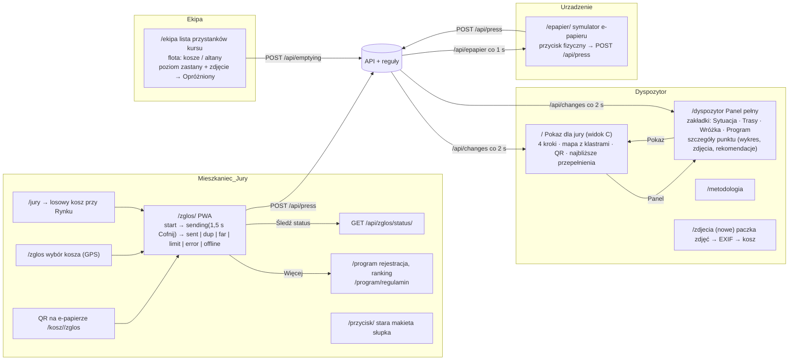

# Etap 1 – rozpoznanie (bez zmian w kodzie)

Data: 3.10.2026, ok. 19:00. Stan kodu: `main` = `f63bb47` (merge PR #1), lokalnie dodatkowo logo, EXIF ze zdjęć i `/zdjecia` (niezacommitowane).
Produkcja: https://trashfairy.twapp.pl (ten sam kod co `main`, sprawdzone po znaczniku widoku C).

## 1. Stos

| Warstwa | Co | Gdzie |
|---|---|---|
| Backend | Python 3.12/3.13, Flask (app factory, 2 blueprinty: `main` widoki, `api` JSON), Flask-SQLAlchemy, SQLite lokalnie / PostgreSQL 16 na prod | `app/__init__.py`, `app/views.py`, `app/api.py` |
| Domena (reguły, bez AI) | stan punktu (`state.py`), prognoza profil 7×24 (`forecast.py`), zgłoszenia i scalanie 15 min (`reports.py`), trasy OR-Tools (`routes.py`) + OSRM tylko do rysowania (`osrm.py`), porównanie 4 tyg. (`comparison.py`), nadużycia (`misuse.py`), program mieszkańców i urządzenia (`residents.py`), e-papier (`epaper.py` + `epaper_render.py`) | `app/*.py` |
| AI (tylko opis) | `app/llm.py` → Claude: raport „Wróżka podpowiada”, Vision zdjęć, godziny wydarzeń z Karnetu; błąd API = komunikat + cache | `fairy.py`, `photos.py`, `karnet.py` |
| Frontend | Jinja + vanilla JS, **bez builda**. Trzy osobne „światy” stylów: (1) widok C `pokaz.css` (IBM Plex, tokeny `--navy/--yellow`), (2) stary panel `fairy.css` + **Tailwind z CDN + DaisyUI** (Fraunces/Inter, zieleń „plant”), (3) PWA `zglos/zglos.css` (IBM Plex, tokeny `TH.light/dark`). `ekipa.html`, `program.html`, `przycisk.html`, `metodologia.html`, `regulamin.html` mają **style inline w `<style>`** w stylu (2) | `app/static/`, `app/templates/` |
| Mapa | Leaflet 1.9.4 z unpkg, kafelki `tile.openstreetmap.org` (CARTO wymaga klucza), `Leaflet.markercluster` tylko w widoku C; stary panel bez klastrów | `pokaz.js`, `panel.js`, `zglos.js` |
| Dane → front | **polling**: panel i widok C `GET /api/changes?since=<version>` co 2 s (odpowiedź pełna tylko przy zmianie wersji), e-papier `GET /api/epapier/<nr>` co 1 s, ekipa i program bez pollingu (fetch przy akcji). Brak SSE/WebSocket. | `api.version()` = zegar + max id naciśnięć/opróżnień/zdjęć |
| Symulacja czasu | `DemoClock` w bazie (1 wiersz; gunicorn ma kilka procesów), `POST /api/clock/advance` (+1 h do `MAX_NOW` = DEMO_NOW + 23 h), `POST /api/clock/reset` (13:30 sob. 3.10 + kasuje naciśnięcia live). Historia 8 tyg. + 24 h „przyszłości” wygenerowana przy `flask seed`. | `app/clock.py`, `app/simulation.py` |
| PWA | manifest + SW tylko dla `/zglos` (zakres `/zglos`, IndexedDB + Background Sync). Ekipa i panel: brak manifestu i SW. | `app/static/zglos/` |
| Testy | pytest 152 (po EXIF), bez testów e2e w przeglądarce; Playwright zainstalowany dziś tylko do audytu | `tests/` |
| Deploy | Dockerfile (gunicorn, port z `PORT`, domyślnie 8080), Coolify, `flask seed` przy starcie | `Dockerfile` |

## 2. Mapa ekranów i przepływów

**Czego nie ma w kodzie (wymagane w briefie):**
- **PWA kierowcy** nie istnieje. `/ekipa` to lista 53 kart z przyciskami „Opróżniony” (na telefonie 17 000 px wysokości), bez mapy, bez „następnego przystanku”, bez nawigacji, bez offline, bez manifestu. Trzeba zbudować (plan w audycie, sekcja F).
- Panel dyspozytora na telefonie nie ma widoku „KPI + lista pilnych”; jest mapa 55 vh + przewijany panel.
- Brak testów end-to-end w przeglądarce.

## 3. Zrzuty ekranu

`docs/audit/screens/` – 152 plików, nazwa `<ekran>-<wariant>-<szerokość>.png`, szerokości 360/390/768/1024/1440/1920, pełna strona poniżej 1024 px.
Skrypt: `python scripts/audit_screens.py [BASE_URL] [OUT]` (Playwright; zapisuje też `_findings.json`: błędy konsoli, poziomy scroll, żądania > 300 ms, czas zgłoszenie → mapa, podwójne kliknięcie).
Warianty: pokaz kroki 1–4; dyspozytor 4 zakładki + szczegóły; zgłoszenie 9 stanów + tryb ciemny; wybór kosza; e-papier; ekipa; program; regulamin; metodologia; stara makieta przycisku.

Surowe pomiary z tej sesji:
- **Zgłoszenie → `fresh` w `/api/points`: 263 ms** (plus do 2 s pollingu panelu). Podwójne kliknięcie przycisku zgłoszenia: drugie kliknięcie nie tworzy drugiej wysyłki (przycisk znika po pierwszym; stan końcowy `sent`, 0 kart „Wysyłamy”).
- **Poziomy scroll:** widok C 360/390 px (strona ma 460 px), panel 360/390 px (469 px) i **1024 px (1339 px!)**, metodologia 360 px (377 px).
- **Konsola:** jedno ostrzeżenie na każdej szerokości panelu: „cdn.tailwindcss.com should not be used in production”. Brak `pageerror`.
- **Żądania > 300 ms:** `/api/comparison` **2 326 ms** (liczone przy pierwszym wejściu na panel, potem cache), `/epapier/<nr>.png` 466 ms (render PNG + `point_states` przy każdym pollingu co 1 s), kafelki OSM 400–780 ms (sieć).

## 4. Stany pojemnika w danych i w UI

Źródło stanu: `state.point_states()` → `state ∈ {ok, warn, bad}` + flagi. Progi: `warn` od 60 %, `bad` powyżej 85 % **albo** świeże zgłoszenie o wadze ≥ 0,7.

| Stan / flaga w danych | Znaczenie | Widok C (`pokaz.js`) | Panel (`panel.js`) | Zgłoszenie (`zglos.js`) | E-papier | Ekipa |
|---|---|---|---|---|---|---|
| `state=ok` | < 60 % | zielone koło ✓ | zielone koło ✓ (18 px) | zielony pin ✓ | `calm`/`night` | — |
| `state=warn` | 60–85 % | bursztynowy romb ↑ „zbliża się do pełna” | bursztynowe koło **~** „zapełnia się” | bursztynowy romb | — (brak osobnego stanu) | — |
| `state=bad` | > 85 % lub świeże zgłoszenie | czerwony kwadrat ! | czerwone koło ! „do opróżnienia” | czerwony kwadrat | `overflow` tylko gdy prognoza ≥ 100 % | kolejność na trasie |
| `fresh` | zgłoszenie z ostatnich 15 min | fioletowy dymek … (ma pierwszeństwo przed `bad`) | czerwony pin z pulsującą obwódką | fioletowy dymek po wysłaniu | `confirm` | — |
| `check_button` + `check_reason` | urządzenie bez sygnału 48 h / mało trafnych zgłoszeń / 6 h przepełnienia bez naciśnięcia | grafitowy trójkąt (tylko gdy nie `bad`) | badge ⚠ na pinie + tekst | baner `nosignal` (tylko dla braku sygnału) | `fault` (brak sygnału lub bateria < 15 %) | — |
| `damaged_at` (nowe) | mieszkaniec zgłosił uszkodzenie | **brak** | badge 🛠 + tekst w liście | — | — | — |
| `overflow_reported` (nowe) | zgłoszenie „odpady obok” | **brak** | tekst w liście | — | — | — |
| `misuse[]` | Vision: worki domowe itp. | **brak** | badge 🛍 | — | — | — |
| `recommendation` / `investment` | reguła altana→kosz, kompaktor itd. | **brak** | tekst + karta w szczegółach | — | — | — |
| `kind=shelter` | altana | podwójna obwódka | kwadrat zamiast koła | — | — | zakładka „Altany” |
| na trasie (`stopOf`) | przystanek na najbliższym kursie | pigułka z numerem/zakresem | numer przy pinie + „🚚 kurs” w liście | — | `enroute` | numer karty |
| `emptied` (opróżnienie < 60 min) | — | **brak** | **brak** | oś statusu po „Śledź status” | `emptied` | karta `done` |

Wnioski do audytu: (1) stan `warn` ma **inny kształt i znak** w widoku C (romb ↑) i w panelu (koło ~), a etykiety różnią się („zbliża się do pełna” vs „zapełnia się”); (2) widok C nie pokazuje `damaged`, `misuse`, rekomendacji; (3) legenda panelu opisuje progi (60 %, 85 %), legenda widoku C opisuje stany, więc jury widzi dwa języki.

## 5. Nazewnictwo (do ujednolicenia)

W UI występują równolegle: „kosz / punkt / pojemnik”, „kurs / trasa”, „przepełniony / do opróźnienia / pełny”, „zgłoszenie / naciśnięcie”. W kodzie: `point`, `bin`, `shelter`, `run`, `route`, `report`, `press`.
